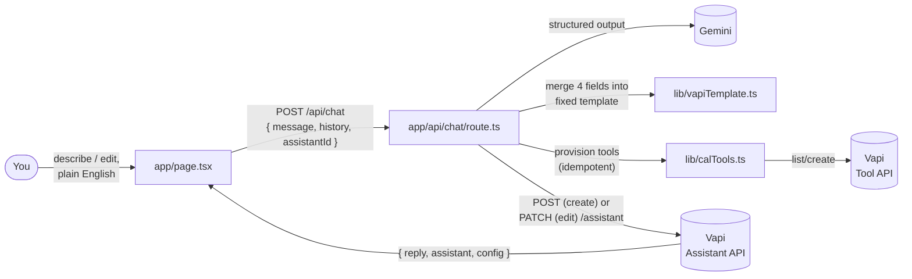
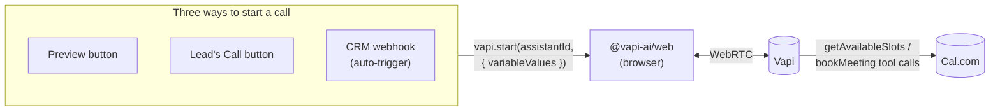
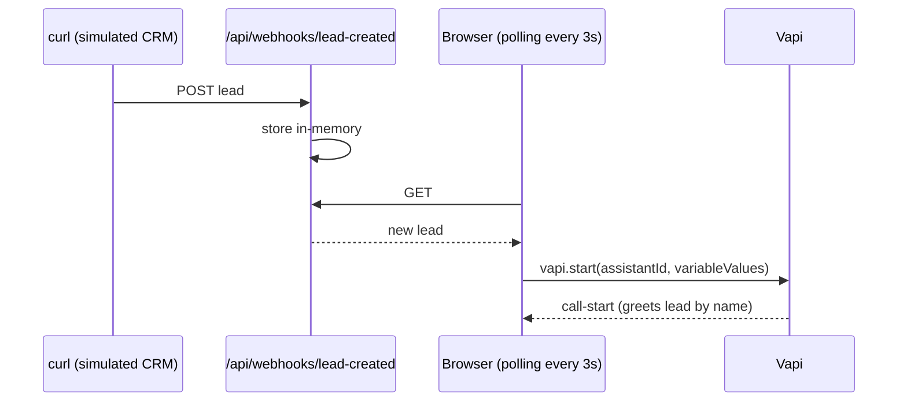

# Alta Voice Builder

A platform where you describe a voice AI sales agent in plain English, and a builder AI turns that description into a real, callable voice agent — one that can call a lead, qualify them, and book a meeting on a real calendar.

Built as a take-home assignment for an AI Engineer role at Alta.

## The core idea: two AIs, stacked

- **The builder AI** (the chat interface) never makes a phone call. You describe the agent you want; it turns that description into a structured configuration — a system prompt, an opening line, a voice.
- **The voice agent** is what the builder just produced. It's the one that actually calls a lead, has a conversation, qualifies them, and books a meeting.

The config the builder writes **is** the voice agent — there's no separate step where a human copies settings over.

## Demo flow

1. **Describe** — type a sentence like "make me an agent that calls SaaS leads, checks budget and decision-maker authority, and books a demo."
2. **Generate** — the builder returns a real, callable Vapi assistant, and shows its config (name, voice, opening line, system prompt) in the UI.
3. **Call** — click "Call" next to a mock lead (or let a simulated CRM webhook trigger it automatically), and a real voice conversation starts in the browser.
4. **Qualify** — the agent asks the questions from its generated system prompt, checks real calendar availability, and proposes a time.
5. **Book** — a real meeting gets created on Cal.com, with a confirmation email.

Editing works too — a follow-up message like "make her more casual" updates the same agent instead of creating a new one.

## Architecture

### Generating (and editing) an agent



Only four fields are ever generated by the model: `name`, `firstMessage`, the system prompt, and `voiceId`. Everything else — model provider, transcriber, endpointing, which tools are attached — is a fixed template the generated fields merge into, so the model can never hallucinate a config Vapi would reject. Conversation history and the assistant's id are both threaded through on every request, which is what makes an edit `PATCH` the existing assistant instead of creating a new one.

### Calling a lead



Every call — preview, a specific lead, or an auto-triggered one — goes through the same `startCall()` path in `app/page.tsx`. The only thing that differs is what's passed as `variableValues`: a lead call passes their name/company/role, which Vapi's LiquidJS templating substitutes into the generated `firstMessage`'s `{{name}}` placeholder so the agent greets them by name. Mid-call, the agent calls `getAvailableSlots` before ever proposing a time, then `bookMeeting` once it has a real slot and the lead's details — both tools hit Cal.com directly.

### CRM webhook auto-trigger



### Key files

| File | Role |
|---|---|
| `app/page.tsx` | Two-panel UI: chat left, generated config right. Owns all call-starting logic and webhook polling. |
| `app/api/chat/route.ts` | The builder endpoint — Gemini structured output, merge, create/edit the Vapi assistant. |
| `lib/vapiTemplate.ts` | The fixed assistant template and merge function; owns the valid `VOICE_IDS` list. |
| `lib/calTools.ts` | Defines the `bookMeeting` and `getAvailableSlots` tools and provisions them idempotently. |
| `lib/leads.ts` | Mock leads standing in for a CRM. |
| `app/api/webhooks/lead-created/route.ts` | Simulated CRM webhook receiver + in-memory list for polling. |
| `app/api/call/route.ts` | Real PSTN call endpoint — written and shown, never executed (see Limitations). |
| `app/api/*-test/route.ts` | Manual probe routes used during development to verify each integration against its real API. |

## Stack

- **Next.js (App Router) + TypeScript + Tailwind**
- **Gemini** (`gemini-3.5-flash-lite`) — the builder brain, via `@google/genai`
- **Vapi** — the voice platform; assistants and tools are created via its REST API
- **Cal.com** — real meeting booking via its v2 API
- **`@vapi-ai/web`** — the browser-based web-call SDK used for the live demo (see Limitations)

## Getting started

```bash
npm install
cp .env.example .env.local   # fill in your own keys
npm run dev
```

Then open http://localhost:3000.

### Environment variables

| Variable | Where to get it |
|---|---|
| `GEMINI_API_KEY` | https://aistudio.google.com/apikey |
| `VAPI_API_KEY` | https://dashboard.vapi.ai/org/api-keys (private key) |
| `NEXT_PUBLIC_VAPI_API_KEY` | same page, public key — safe to expose in the browser |
| `CAL_API_KEY` | https://app.cal.com/settings/developer/api-keys |

## Mock leads & the CRM webhook

`lib/leads.ts` has 3 mock leads standing in for a CRM. Their field names map directly onto common CRM contact properties, so swapping in a real Salesforce/HubSpot record is a one-line change, not a rearchitecture.

`app/api/webhooks/lead-created/route.ts` simulates a CRM's "contact created" webhook — POST a lead, and the UI (which polls every few seconds) picks it up and auto-starts a call, no button press needed:

```bash
curl -X POST http://localhost:3000/api/webhooks/lead-created \
  -H "Content-Type: application/json" \
  -d '{"name":"Jordan Rivera","company":"Acme Co","role":"CTO","phone":"+1-555-9999"}'
```

## Limitations

- **Web calls, not real phone calls.** Every telephony carrier requires government photo ID to provision a number capable of dialing internationally, which wasn't something I was willing to submit for a take-home assignment. `app/api/call/route.ts` is written and shows exactly what a real PSTN call would look like (the same endpoint, given a real `phoneNumberId`), but it's never executed — every call in this demo runs over WebRTC in the browser instead.
- **Mocked leads, not a real CRM.** A lead is a name and a phone number for the purposes of this assignment; `lib/leads.ts`'s shape is designed so a real CRM record drops in as a one-line change.
- **In-memory webhook store.** The webhook's lead list lives in a plain array that resets on server restart — fine for a local demo, not for production. A real deployment would persist to a database and likely push updates instead of polling.
- **No call-log panel or real monitoring.** Out of scope for the time available; would sit alongside a real observability tool (Datadog/Mixpanel) in production.
- **English only.**

## Project docs

- [`DECISIONS.md`](./DECISIONS.md) — a full decision log: every real choice made in this project, what was weighed against it, and why. Written for interview prep and video narration.
- [`CLAUDE.md`](./CLAUDE.md) — project brief and working rules used to keep an AI coding assistant oriented across sessions.
